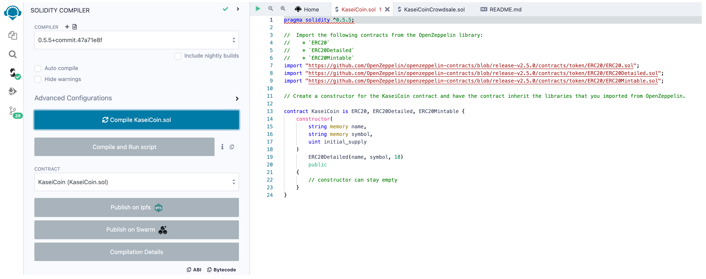

# Module_21 - Tokenomics

After waiting for years and passing several tests, I was selected by the Martian Aerospace Agency to be part of the first human colony on Mars. As a prominent fintech professional, I was chosen to lead a project to develop a monetary system for the new Mars colony. I have decided to base this new monetary system on blockchain technology, and to define a new cryptocurrency called KaseiCoin. (“Kasei” means “Mars” in Japanese.)

KaseiCoin will be a fungible token that is ERC-20 compliant. I will launch a crowdsale that will allow people who are moving to Mars to convert their earthling money to KaseiCoin.

---

## Technologies

This project leverages Solidity Version 0.5.5 using the following IDE:

* [Remix IDE](https://remix.ethereum.org/) - Remix IDE is used for the entire journey of smart contract development by users at every knowledge level. It requires no setup, fosters a fast development cycle and has a rich set of plugins with intuitive GUIs.

* [Ganache](https://www.trufflesuite.com/ganache) - Quickly fire up a personal Ethereum blockchain which you can use to run tests, execute commands, and inspect state while controlling how the chain operates.

* [MetaMask](https://metamask.io/) - Browser plugin used as a crypto wallet and a gateway to blockchain applications.

---

## Installation Guide

No new installations are required - this project is run entirely online.  

---

## Usage

Just upload the Solidity file contained in this repository to your Remix IDE workspace.

---

## Evaluation Evidence

### Successful Compilation of KaseiCoin

### Successful Compilation of KaseiCoinCrowdsale and KaseiCoinCrowdsaleDeployer

### Successful Deployment

---

## Contributors

Starter code was provided by UW Fintech Bootcamp.  Updates and analysis by Jason Buckholt.  

---

## License

MIT License

Copyright (c) 2022 Jason Buckholt

Permission is hereby granted, free of charge, to any person obtaining a copy of this software and associated documentation files (the "Software"), to deal in the Software without restriction, including without limitation the rights to use, copy, modify, merge, publish, distribute, sublicense, and/or sell copies of the Software, and to permit persons to whom the Software is furnished to do so, subject to the following conditions:

The above copyright notice and this permission notice shall be included in all copies or substantial portions of the Software.

THE SOFTWARE IS PROVIDED "AS IS", WITHOUT WARRANTY OF ANY KIND, EXPRESS OR IMPLIED, INCLUDING BUT NOT LIMITED TO THE WARRANTIES OF MERCHANTABILITY, FITNESS FOR A PARTICULAR PURPOSE AND NONINFRINGEMENT. IN NO EVENT SHALL THE AUTHORS OR COPYRIGHT HOLDERS BE LIABLE FOR ANY CLAIM, DAMAGES OR OTHER LIABILITY, WHETHER IN AN ACTION OF CONTRACT, TORT OR OTHERWISE, ARISING FROM, OUT OF OR IN CONNECTION WITH THE SOFTWARE OR THE USE OR OTHER DEALINGS IN THE SOFTWARE.